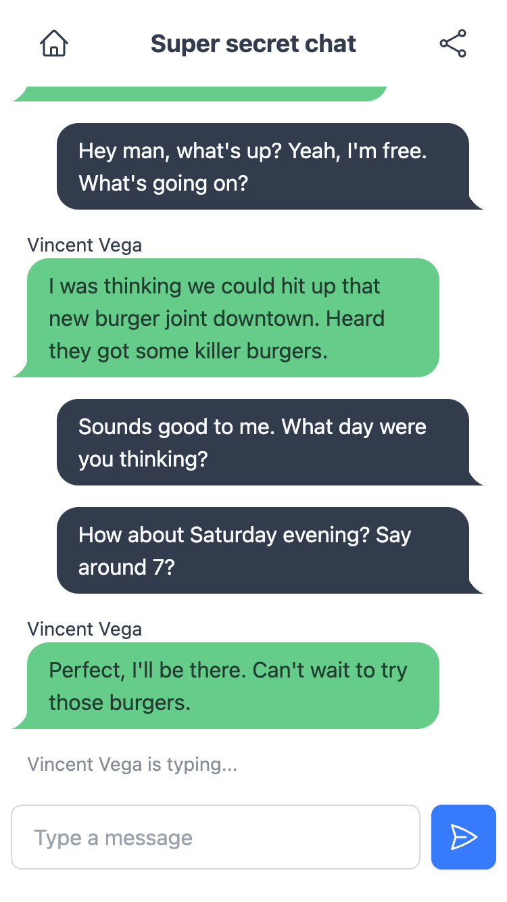

# gochat

This is a simple web messaging application built with Go and Vue.js. Users can create rooms and chat with other in real-time. The application uses WebSockets for real-time communication.

Check out the [live application](https://chat.olzhasar.com/)

## Features
- Create rooms with unique URLs
- Invite others by sharing the room URL
- Real-time messaging
- Typing indicators
- Leave and join notifications
- Automatic room termination after 1 minute of inactivity

## Technologies
- Go
- Gorilla WebSockets library
- Vue.js
- Vite
- Tailwind CSS
- DaisyUI

## Requirements
- Go 1.22
- Node.js
- npm

## Running the application
1. Clone the repository
2. Run `make run` inside the backend directory to start the backend server
3. Navigate to the `frontend` directory and run `npm install` to install the dependencies
4. Run `make run` inside the `frontend` directory to start the frontend server

## Contributing
This is a hobby project and I currently don't have any serious plans for it. However, if you find a bug or have a feature request, feel free to open an issue or submit a pull request.

## License
This project is licensed under the MIT License - see the [LICENSE](LICENSE) file for details.
